# 移动控制台使用手册

### 系统登录和主界面
在浏览器输入控制台的访问地址`http://部署地址:8099/mobile`，进入登录界面，输入用户名和密码，点击登录按钮即可进入主界面。

控制台默认账号密码为`superman`/`Helloworld!`
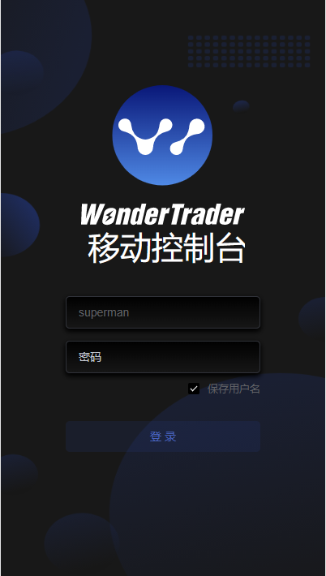

主界面默认显示监控中心
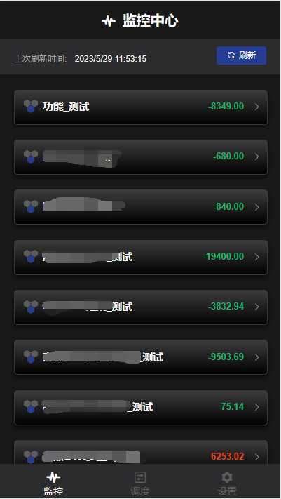

导航栏位于底部，一共三个入口：
* 监控中心
* 调度中心
* 设置中心

### 监控中心
在监控中心区，展示了组合的基本信息，以及最后一个交易日的*盈亏情况*，点击**刷新**按钮，可以刷新组合的最新当日*盈亏数据*。点击右侧的箭头，可以展开查看组合的*净值走势*和*分品种绩效归因*。
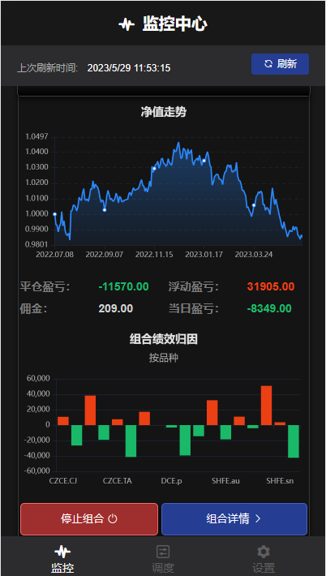

下方有两个按钮，其中*停止组合*按钮会根据组合的运行状态自动在*停止组合*和*启动组合*两个状态之间切换。点击*停止组合*按钮，会弹出确认框，点击*确认*按钮，即可停止组合。点击*启动组合*按钮，即可启动组合。
而对于*组合详情*按钮，则会跳转到组合详情页面。
由于移动版控制台的定位不同，如果要使用更多组合管理的功能，请使用PC版控制台。

### 组合详情
组合详情页面，包含了组合的持仓、交易、回合以及资金数据
* 组合持仓明细，上半部分是*不同品种的累计收益*的柱状图，下半部分为组合的*持仓明细表*
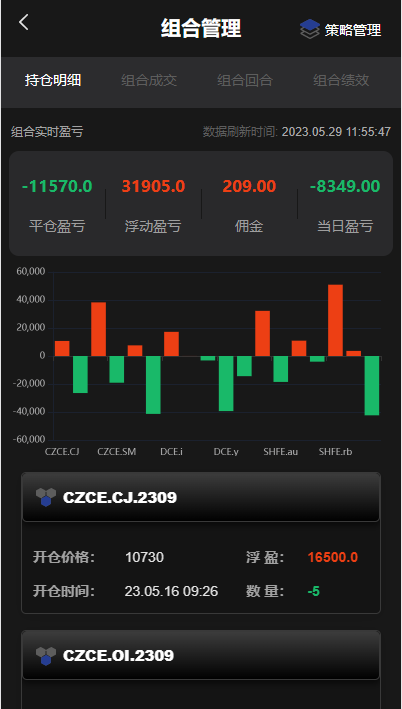

* 组合成交明细
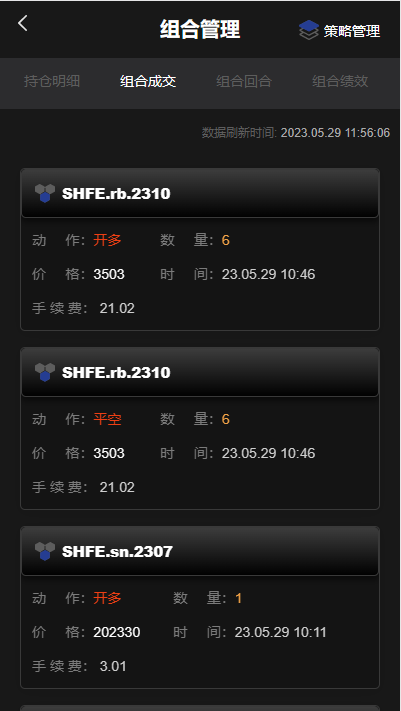

* 组合回合明细

* 组合每日资金及净值曲线
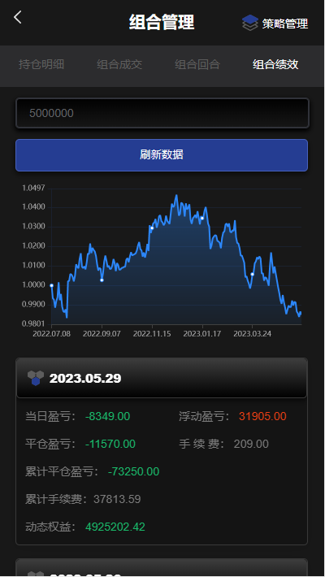

### 策略详情
点击组合管理右上角的*策略管理*按钮，即可进入策略详情页面。策略详情的首页，展示了指定组合的策略列表。展开单个策略卡片，可以看到策略的最后一个交易日的*盈亏情况*，点击右侧的箭头，可以展开查看策略在当前交易日的资金情况以及净值走势。
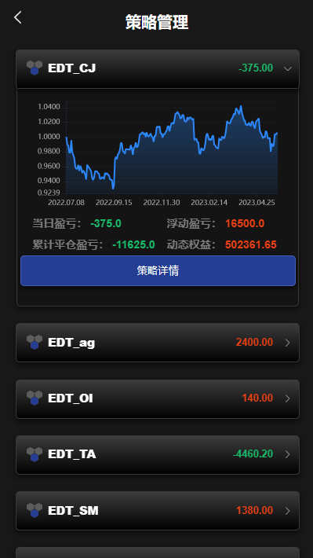

点击*策略详情*按钮，跳转到策略详情页面，该页面包含了策略的持仓、交易、信号、回合以及资金数据。
* 策略持仓明细
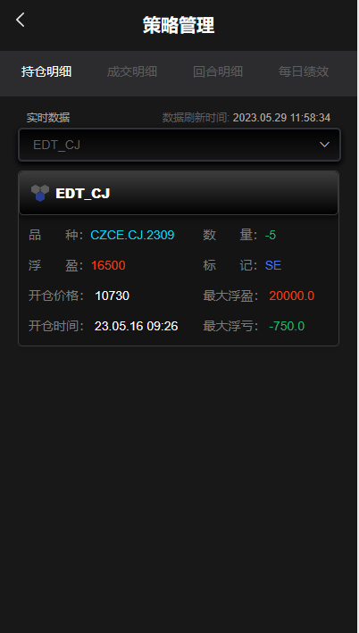

* 策略成交明细
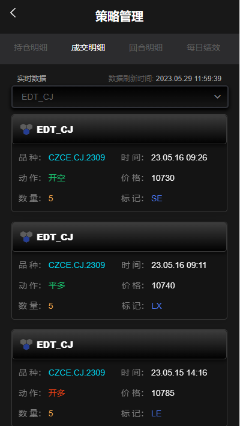

* 策略回合明细
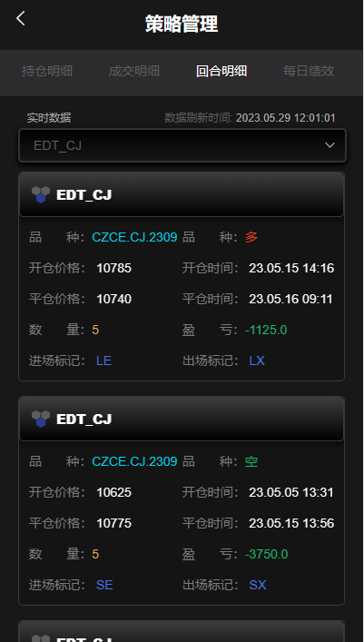

* 策略每日资金及净值曲线
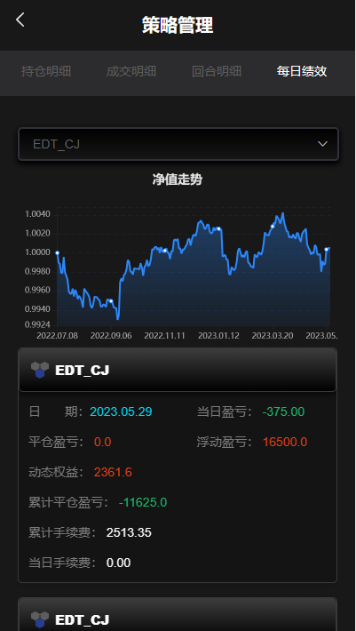

### 调度中心
调度管理，即对程序的调度进行管理。调度管理主要包括两个部分，一个是程序的调度配置，一个是调度日志。移动版只提供了*启动*和*停止*的操作，如果需要修改调度配置，请使用PC版控制台。
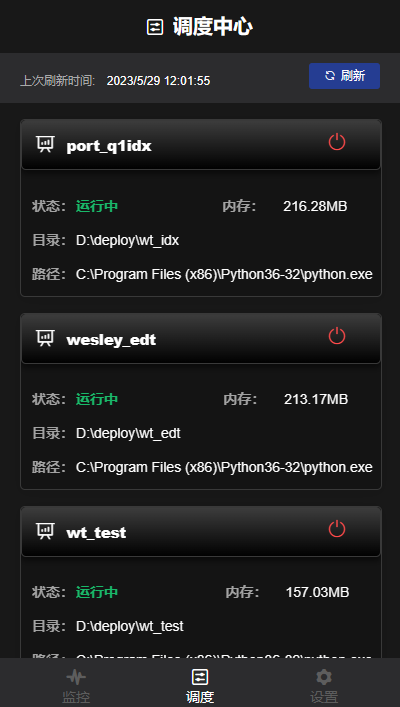

### 设置中心
目前设置中心只提供了修改登录密码的功能，如果需要修改其他配置，请使用PC版控制台。
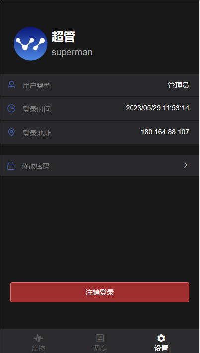