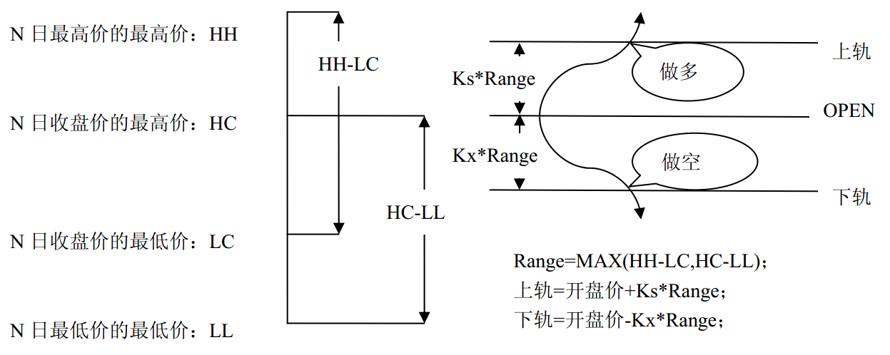

# 使用C++编写策略

### C++策略和Python策略对比
**WonderTrader**作为一个`C++`的量化交易平台，使用`C++`编写策略是一个很自然的事情。也只有用`C++`编写的策略，才能将**WonderTrader**的性能优势发挥到极致。

相较于`wtpy`使用`python`开发策略，`C++`开发策略的难度提升了不少，对于开发人员的要求也提高了非常多。但是即便如此，`C++`带来的性能上的跃升，还是让不少用户客服了重重困难，使用`C++`编写策略。

笔者曾经做过一个性能对比。`DualThrust`是一个非常经典的CTA日内策略，从上个世纪八十年代出现到现在，曾经长期在“**前十大最赚钱的策略**”中占有一席之地。`DualThrust`的基本逻辑并不复杂，如下图所示：



用`MAX(HH-LC,HC-LL)`，作为计算*上下边界*的基准值，用*今日开盘价*作为基准价，然后用*上边界系数*和*下边界系数*，分别计算出上边界的价格和下边界的价格，最终的策略逻辑如下：
* 当持仓为0的时候，价格突破上边界时，开多进场，价格突破下边界时，开空进场
* 当持仓为多的时候，价格突破上边界时，保持仓位，价格突破下边界时，多反空
* 当持仓为空的时候，价格突破上边界时，空反多，价格突破下边界时，保持仓位

笔者分别用`C++`和`Python`实现了该策略。`C++`版本核心逻辑代码如下：
```cpp
void WtStraDualThrust::on_schedule(ICtaStraCtx* ctx, uint32_t curDate, uint32_t curTime)
{
	std::string code = _code;

	WTSKlineSlice *kline = ctx->stra_get_bars(code.c_str(), _period.c_str(), _count, true);
	if(kline == NULL)
	{
		//这里可以输出一些日志
		return;
	}

	if (kline->size() == 0)
	{
		kline->release();
		return;
	}


	int32_t days = (int32_t)_days;

	double hh = kline->maxprice(-days, -2);
	double ll = kline->minprice(-days, -2);

	WTSValueArray* closes = kline->extractData(KFT_CLOSE);
	double hc = closes->maxvalue(-days, -2);
	double lc = closes->minvalue(-days, -2);
	double curPx = closes->at(-1);
	closes->release();///!!!这个释放一定要做

	double openPx = kline->at(-1)->open;

	double upper_bound = openPx + _k1 * (std::max(hh - lc, hc - ll));
	double lower_bound = openPx - _k2 * std::max(hh - lc, hc - ll);

	//设置指标值
	ctx->set_index_value("DualThrust", "upper_bound", upper_bound);
	ctx->set_index_value("DualThrust", "lower_bound", lower_bound);

	WTSCommodityInfo* commInfo = ctx->stra_get_comminfo(_code.c_str());

	double curPos = ctx->stra_get_position(_moncode.c_str()) / trdUnit;
	if(decimal::eq(curPos,0))
	{
		if(curPx >= upper_bound)
		{
			ctx->stra_enter_long(_moncode.c_str(), 1, "DT_EnterLong");
			//向上突破
			ctx->stra_log_info(fmt::format("向上突破{}>={},多仓进场", curPx, upper_bound).c_str());

			//添加图表标记
			ctx->add_chart_mark(curPx, "wt-mark-buy", "DT_EnterLong");
		}
		else if (curPx <= lower_bound && !_isstk)
		{
			ctx->stra_enter_short(_moncode.c_str(), 1, "DT_EnterShort");
			//向下突破
			ctx->stra_log_info(fmt::format("向下突破{}<={},空仓进场", curPx, lower_bound).c_str());
		}
	}
	//else if(curPos > 0)
	else if (decimal::gt(curPos, 0))
	{
		if(curPx <= lower_bound)
		{
			//多仓出场
			ctx->stra_exit_long(_moncode.c_str(), 1, "DT_ExitLong");
			ctx->stra_log_info(fmt::format("向下突破{}<={},多仓出场", curPx, lower_bound).c_str());
		}
	}
	//else if(curPos < 0)
	else if (decimal::lt(curPos, 0))
	{
		if (curPx >= upper_bound && !_isstk)
		{
			//空仓出场
			ctx->stra_exit_short(_moncode.c_str(), 1, "DT_ExitShort");
			ctx->stra_log_info(fmt::format("向上突破{}>={},空仓出场", curPx, upper_bound).c_str());
		}
	}

	//这个释放一定要做
	kline->release();
}
```

`Python`版本核心逻辑如下：
```py
    def on_calculate(self, context:CtaContext):
        code = self.__code__    #品种代码

        trdUnit = 1

        #读取最近50条1分钟线(dataframe对象)
        theCode = code
        if self.__is_stk__:
            theCode = theCode + "-" # 如果是股票代码，后面加上一个+/-，+表示后复权，-表示前复权
        df_bars = context.stra_get_bars(theCode, self.__period__, self.__bar_cnt__, isMain = True)

        #把策略参数读进来，作为临时变量，方便引用
        days = self.__days__
        k1 = self.__k1__
        k2 = self.__k2__

        #平仓价序列、最高价序列、最低价序列
        closes = df_bars.closes
        highs = df_bars.highs
        lows = df_bars.lows

        #读取days天之前到上一个交易日位置的数据
        hh = np.amax(highs[-days:-1])
        hc = np.amax(closes[-days:-1])
        ll = np.amin(lows[-days:-1])
        lc = np.amin(closes[-days:-1])

        #读取今天的开盘价、最高价和最低价
        # lastBar = df_bars.get_last_bar()
        openpx = df_bars.opens[-1]
        highpx = df_bars.highs[-1]
        lowpx = df_bars.lows[-1]

        '''
        !!!!!这里是重点
        1、首先根据最后一条K线的时间，计算当前的日期
        2、根据当前的日期，对日线进行切片,并截取所需条数
        3、最后在最终切片内计算所需数据
        '''

        #确定上轨和下轨
        upper_bound = openpx + k1* max(hh-lc,hc-ll)
        lower_bound = openpx - k2* max(hh-lc,hc-ll)

        #读取当前仓位
        curPos = context.stra_get_position(code)/trdUnit

        if curPos == 0:
            if highpx >= upper_bound:
                context.stra_enter_long(code, 1, 'enterlong')
                context.stra_log_text(f"向上突破{highpx:.2f}>={upper_bound:.2f}，多仓进场")
                return

            if lowpx <= lower_bound and not self.__is_stk__:
                context.stra_enter_short(code, 1, 'entershort')
                context.stra_log_text(f"向下突破{lowpx:.2f}<={lower_bound:.2f}，空仓进场")
                return
        elif curPos > 0:
            if lowpx <= lower_bound:
                context.stra_exit_long(code, 1, 'exitlong')
                context.stra_log_text(f"向下突破{lowpx:.2f}<={lower_bound:.2f}，多仓出场")
                return
        else:
            if highpx >= upper_bound and not self.__is_stk__:
                context.stra_exit_short(code, 1, 'exitshort')
                context.stra_log_text(f"向上突破{highpx:.2f}>={upper_bound:.2f}，空仓出场")
                return
```
回测的参数如下：
* 时间区间：2017.01.01 09:30 - 2019.12.01 15:00
* 回测合约：CFFEX.IF.HOT
* 数据周期：m5

回测的性能对比：
* 共回放**33024**条K线
* python版本单次主逻辑重算平均耗时**73.301us**
* C++版本单次主逻辑重算平均耗时**4.575us**

从上面的结果，很容易就可以看出来，`C++`版本的性能大约是`Python`版本性能的**16倍**左右。这样的性能提升，尤其对于很多延迟敏感的策略来说，确实值得再基于**WonderTrader**做一个`C++`版本的策略了。

### C++策略的创建流程
前面的`DualThrust`策略，其实就是一个基于`C++`实现的`CTA`策略。我们在使用`C++`开发策略的时候，主要参考解决方案中自带的以下几个工程：
* `WtCtaStraFact` - `CTA`策略工厂工程
* `WtSelStraFact` - `SEL`策略工厂工程
* `WtHftStraFact` - `HFT`策略工厂工程
* `WtUftStraFact` - `UFT`策略工厂工程

从上面就可以很容易看出来，策略工程都是采用的**工厂模式**来组织和实现的。工厂模式，是一种非常常用的设计模式，是一种创建对象的最佳方式。工厂模式主要有以下两种类：
* **工厂类**，调用者创建对象时，只需要调用工厂类的创建接口，即可创建出对应的策略对象
* 产品类，在策略工厂的语境下，即**策略类**。工厂类在创建策略对象的时候，调用策略的构造函数

从上面的描述可以看出来，工厂类封装了不同策略的调用细节，返回给调用者一个统一的接口对象。这样的好处就是包括以下几点：
* 创建策略时，只需要只掉工厂创建策略时所需要的名称即可
* 很容易横向扩展，工厂模块可以扩展出很多个不同策略的实现，而接口调用部分不会受到任何影响
* 屏蔽了策略的具体实现，使用者只需要关心策略的通用接口即可

我们以`WtCtaStraFact`工程为例，其工厂类接口的定义如下：
```cpp

//////////////////////////////////////////////////////////////////////////
//策略工厂接口
typedef void(*FuncEnumStrategyCallback)(const char* factName, const char* straName, bool isLast);

class ICtaStrategyFact
{
public:
	ICtaStrategyFact(){}
	virtual ~ICtaStrategyFact(){}

public:
	/*
	 *	获取工厂名
	 */
	virtual const char* getName() = 0;

	/*
	 *	枚举策略
	 */
	virtual void enumStrategy(FuncEnumStrategyCallback cb) = 0;

	/*
	 *	根据名称创建K线级别策略
	 */
	virtual CtaStrategy* createStrategy(const char* name, const char* id) = 0;


	/*
	 *	删除策略
	 */
	virtual bool deleteStrategy(CtaStrategy* stra) = 0;
};

//创建执行工厂
typedef ICtaStrategyFact* (*FuncCreateStraFact)();
//删除执行工厂
typedef void(*FuncDeleteStraFact)(ICtaStrategyFact* &fact);
```

从上面的代码可以看出来，除了工厂类接口的定义之外，还定义了工厂类接口**创建**和**删除**的函数指针，这两个函数指针主要是用于最终编译出来的模块中实现，这样外部程序加载策略工厂模块的时候，可以直接调用这两个接口进行**工厂类对象的创建和销毁**工作，实现的代码如下：
```cpp
extern "C"
{
	EXPORT_FLAG ICtaStrategyFact* createStrategyFact()
	{
		ICtaStrategyFact* fact = new WtStraFact();
		return fact;
	}

	EXPORT_FLAG void deleteStrategyFact(ICtaStrategyFact* fact)
	{
		if (fact != NULL)
			delete fact;
	}
};
```

最后，我们再看一下策略工厂其他几个接口的实现代码：
```cpp
CtaStrategy* WtStraFact::createStrategy(const char* name, const char* id)
{
	if (strcmp(name, "DualThrust") == 0)
		return new WtStraDualThrust(id);

	return NULL;
}

bool WtStraFact::deleteStrategy(CtaStrategy* stra)
{
	if (stra == NULL)
		return true;

	if (strcmp(stra->getFactName(), FACT_NAME) != 0)
		return false;

	delete stra;
	return true;
}

void WtStraFact::enumStrategy(FuncEnumStrategyCallback cb)
{
	cb(FACT_NAME, "DualThrust", true);
}

const char* WtStraFact::getName()
{
	return FACT_NAME;
}
```

综合前面的介绍，可以总结出`C++`策略工厂模块的调用流程：
* 首先，加载工厂模块`xxxStraFact.dll`(linux下为.so，下同)
* 调用工厂创建接口`createStrategyFact`，得到工厂对象`IXXXStrategyFact`的指针
* 调用工厂对象`IXXXStrategyFact`的接口`createStrategy`创建策略对象`XXXStrategy`的指针
* 调用策略对象`XXXStrategy`的`init`接口进行初始化
* `C++`策略创建完成，将策略加入`XXXEngine`中，等待`XXXEngine`内部调度逻辑触发


### C++策略的定义介绍
前面介绍了`C++`策略在策略工厂中如何创建的，最终策略逻辑还是要在策略本身来实现。不同类型的策略，定义略有区别。
`SEL`策略的定义和`CTA`策略比较类似，以`CTA`策略为例，策略类定义如下：
```cpp
class CtaStrategy
{
public:
	CtaStrategy(const char* id) :_id(id){}
	virtual ~CtaStrategy(){}

public:
	/*
	*	执行单元名称
	*/
	virtual const char* getName() = 0;

	/*
	*	所属执行器工厂名称
	*/
	virtual const char* getFactName() = 0;

	/*
	*	初始化
	*/
	virtual bool init(WTSVariant* cfg){ return true; }

	virtual const char* id() const { return _id.c_str(); }

	/*
	 *	初始化回调
	 */
	virtual void on_init(ICtaStraCtx* ctx){}

	/*
	 *	交易日开始
	 */
	virtual void on_session_begin(ICtaStraCtx* ctx, uint32_t uTDate) {}

	/*
	 *	交易日结束
	 */
	virtual void on_session_end(ICtaStraCtx* ctx, uint32_t uTDate) {}

	/*
	 *	主体逻辑执行入口
	 */
	virtual void on_schedule(ICtaStraCtx* ctx, uint32_t uDate, uint32_t uTime){}

	/*
	 *	主体逻辑执行完成
	 */
	virtual void on_schedule_done(ICtaStraCtx* ctx, uint32_t uDate, uint32_t uTime) {}

	/*
	 *	tick数据
	 */
	virtual void on_tick(ICtaStraCtx* ctx, const char* stdCode, WTSTickData* newTick){}

	/*
	 *	K线闭合
	 */
	virtual void on_bar(ICtaStraCtx* ctx, const char* stdCode, const char* period, WTSBarStruct* newBar){}

	/*
	 *	条件单触发
	 */
	virtual void on_condition_triggered(ICtaStraCtx* ctx, const char* stdCode, double target, double price, const char* usertag) {}

protected:
	std::string _id;
};
```

`HFT`策略和`UFT`策略，因为直接和交易通道交互，所以策略的定义会更复杂一些。`UFT`策略的定义大致和`HFT`一样，以`UFT`策略为例，策略定义如下：
```cpp
class UftStrategy
{
public:
	UftStrategy(const char* id) :_id(id){}
	virtual ~UftStrategy(){}

public:
	/*
	*	执行单元名称
	*/
	virtual const char* getName() = 0;

	/*
	*	所属执行器工厂名称
	*/
	virtual const char* getFactName() = 0;

	/*
	*	初始化
	*/
	virtual bool init(WTSVariant* cfg){ return true; }

	virtual const char* id() const { return _id.c_str(); }

	//回调函数

	/*
	 *	初始化事件
	 *	生命周期中只会回调一次
	 */
	virtual void on_init(IUftStraCtx* ctx) = 0;

	/*
	 *	交易日开始事件
	 *	实盘时因为每天重启，所以会在on_init后调用一次
	 *	回测时，生命周期中会调用多次
	 *	如果有什么数据需要每天初始化，可以放到这个回调中处理，实盘就和回测保持一致了
	 */
	virtual void on_session_begin(IUftStraCtx* ctx, uint32_t uTDate) {}

	/*
	 *	交易日结束事件
	 */
	virtual void on_session_end(IUftStraCtx* ctx, uint32_t uTDate) {}

	/*
	 *	tick推送
	 */
	virtual void on_tick(IUftStraCtx* ctx, const char* stdCode, WTSTickData* newTick) {}

	/*
	 *	K线闭合事件
	 *
	 *	@stdCode	合约代码，格式如SHFE.rb2205
	 *	@period		周期
	 *	@times		重采样倍数
	 */
	virtual void on_bar(IUftStraCtx* ctx, const char* stdCode, const char* period, uint32_t times, WTSBarStruct* newBar) {}

	/*
	 *	成交回报
	 *
	 *	@localid	本地订单id
	 *	@stdCode	合约代码，格式如SHFE.rb2205
	 *	@isLong		是否做多
	 *	@offset		开平，0-开仓，1-平仓，2-平今
	 *	@vol		成交量
	 *	@price		成交价格
	 */
	virtual void on_trade(IUftStraCtx* ctx, uint32_t localid, const char* stdCode, bool isLong, uint32_t offset, double vol, double price) {}

	/*
	 *	持仓同步回报
	 *	交易通道连接成功时，如果查到持仓，会推送一次
	 *	如果没有查到，则不会推送，所以这个事件接口不适合放任何状态相关的东西
	 * 
	 *	@stdCode	合约代码，格式如SHFE.rb2205
	 *	@isLong		是否做多
	 *	@prevol		昨仓
	 *	@preavail	可用昨仓
	 *	@newvol		今仓	
	 *	@newavail	可用今仓
	 */
	virtual void on_position(IUftStraCtx* ctx, const char* stdCode, bool isLong, double prevol, double preavail, double newvol, double newavail) {}

	/*
	 *	订单
	 *
	 *	@localid	本地订单id
	 *	@stdCode	合约代码，格式如SHFE.rb2205
	 *	@isLong		是否做多
	 *	@offset		开平，0-开仓，1-平仓，2-平今
	 *	@totalQty	下单总数
	 *	@leftQty	剩余数量
	 *	@price		委托价格
	 *	@isCanceled	是否已撤销
	 */
	virtual void on_order(IUftStraCtx* ctx, uint32_t localid, const char* stdCode, bool isLong, uint32_t offset, double totalQty, double leftQty, double price, bool isCanceled) {}

	/*
	 *	交易通道就绪事件
	 */
	virtual void on_channel_ready(IUftStraCtx* ctx) {}

	/*
	 *	交易通道断线事件
	 */
	virtual void on_channel_lost(IUftStraCtx* ctx) {}

	/*
	 *	下单回报
	 *	有些接口只有错单才会有回报，所以不能使用该接口作为下单是否成功的回报
	 *
	 *	@localid	本地单号
	 *	@bSuccess	是否成功
	 *	@message	返回消息
	 */
	virtual void on_entrust(uint32_t localid, bool bSuccess, const char* message) {}

protected:
	std::string _id;
};
```

### 如何编写自己的`C++`策略
前面介绍了策略工厂以及不同类型的策略定义，也梳理了策略创建及初始化的基本流程。不过策略，最终还是要落在策略类本身的实现上。我们以`WtCtaStraFact`工厂下的`StraDualThrust`为例，前面已经介绍了策略的主体计算逻辑`on_schedule`，下面我们再来根据策略的接口调用顺序来分步介绍一下该策略的具体实现。

首先被调用的是策略的**构造函数**，这个比较简单，不会有太多额外的参数传入，代码如下：
```cpp
WtStraDualThrust::WtStraDualThrust(const char* id)
	: CtaStrategy(id)
{
}
```

策略创建成功以后，会调用策略的`init`接口，传入策略的参数，代码如下：
```cpp
bool WtStraDualThrust::init(WTSVariant* cfg)
{
	if (cfg == NULL)
		return false;

	_days = cfg->getUInt32("days");     //每次要读取的K线条数
	_k1 = cfg->getDouble("k1");         //上轨系数
	_k2 = cfg->getDouble("k2");         //下轨系数

	_period = cfg->getCString("period");    //K线周期
	_count = cfg->getUInt32("count");       //计算轨道宽度引用的K线条数，小于days
	_code = cfg->getCString("code");        //策略的标的

	return true;
}
```

策略参数传入结束以后，则触发策略的`on_init`接口。这个`on_init`接口和`init`不同的地方在于：`init`是对象创建之后马上就会调用，主要用于传入策略参数；而`on_init`是策略运行流程中的一环，主要作用是让策略在这个接口中，处理一些数据订阅和数据准备的工作。一般来说，`init`是不涉及到策略运行的环境，所以并不给策略传入`Context`指针，而`on_init`是策略运行环境就绪以后才会触发。`on_init`代码如下：
```cpp
void WtStraDualThrust::on_init(ICtaStraCtx* ctx)
{
	std::string code = _code;
	ctx->stra_sub_ticks(_code.c_str());
	WTSKlineSlice *kline = ctx->stra_get_bars(code.c_str(), _period.c_str(), _count, true);
	if (kline == NULL)
	{
		//这里可以输出一些日志
		return;
	}

	kline->release();
}
```

策略初始化完成以后，会调用`on_session_begin`接口，如果是生产环境，每次启动就调用一次该接口。`DualThrust`策略实现中，在交易日开始的时候实现了一个主力合约换月的逻辑，代码如下：
```cpp
void WtStraDualThrust::on_session_begin(ICtaStraCtx* ctx, uint32_t uTDate)
{
	std::string newMonCode = ctx->stra_get_rawcode(_code.c_str());
	if(newMonCode!=_moncode)
	{
		if(!_moncode.empty())
		{
			double curPos = ctx->stra_get_position(_moncode.c_str());
			if (!decimal::eq(curPos, 0))
			{
				ctx->stra_log_info(fmt::format("主力换月,  老主力{}[{}]将会被清理", _moncode, curPos).c_str());
				ctx->stra_set_position(_moncode.c_str(), 0, "switchout");
				ctx->stra_set_position(newMonCode.c_str(), curPos, "switchin");
			}
		}

		_moncode = newMonCode;
	}
}
```

调用完以上接口以后，策略已经处于一个就绪状态，这个时候则会根据策略订阅的主K线的频率来触发`on_shedule`接口，这个接口前面做不同版本的对比的时候已有提及，这里就不做赘述了。

如果在`on_init`订阅了`tick`数据，那么每个`tick`到来的时候还会触发`on_tick`接口。回测框架中，如果没有开启`tick`回测，则会使用K线的开高低收来模式4笔`tick`数据，并触发`on_tick`回调。代码如下：
```cpp
void WtStraDualThrust::on_tick(ICtaStraCtx* ctx, const char* stdCode, WTSTickData* newTick)
{
	//没有什么要处理
}
```

最后每个交易日结束的时候，会触发`on_session_end`接口，这里可以放一些收盘作业的逻辑，保存一些用户自定义的数据。值得一提的是，如果这里增加了一些自定义数据的保存，那么千万不要忘记在`on_session_begin`里对保存的数据做一个加载和处理。
```cpp
void WtStraDualThrust::on_session_end(ICtaStraCtx* ctx, uint32_t uTDate)
{
	//没有什么要处理
}
```

如果你觉得在`on_session_begin`和`on_session_end`两个接口处理自定义数据加载和保存比较麻烦的话，`Context`中还提供了`stra_save_user_data`和`stra_load_user_data`两个接口，框架底层会自动处理好数据保存和加载的逻辑，不需要再增加额外的代码。

### Context模式
实际上在使用`C++`编写策略时，策略需要调用的接口都封装到了`Context`对象中。这种模式的好处就是策略只需要跟`Context`打交道，无需在引入其他接口对象，如果要扩展接口的话，也只需要从`Context`入手即可。回测框架和实盘框架，只需要将`Context`做不同实现即可，对于策略来说，是不需要区分实盘和回测环境的。

此外，为了保证`wtpy`和**WonderTrader**使用上的一致性，`wtpy`也将`Strategy`+`Context`这种模式直接照搬了过去，并且统一了`Python`和`C++`中`Context`的接口名。

以下为`ICtaStraCtx`接口的部分定义：
```cpp
class ICtaStraCtx
{
public:

	//回调函数
	virtual void on_init() = 0;
	virtual void on_session_begin(uint32_t uTDate) = 0;
	virtual void on_session_end(uint32_t uTDate) = 0;
	virtual void on_tick(const char* stdCode, WTSTickData* newTick, bool bEmitStrategy = true) = 0;
	virtual void on_bar(const char* stdCode, const char* period, uint32_t times, WTSBarStruct* newBar) = 0;
	virtual bool on_schedule(uint32_t curDate, uint32_t curTime) = 0;
	/*
	 *	回测结束事件
	 *	只在回测下才会触发
	 */
	virtual void on_bactest_end() {};

	/*
	 *	重算结束
	 *	设计目的是要把on_calculate分成两步
	 *	方便一些外挂的逻辑接入进来，可以在on_calculate_done执行信号
	 */
	virtual void on_calculate_done(uint32_t curDate, uint32_t curTime) { };

	virtual void on_bar_close(const char* stdCode, const char* period, WTSBarStruct* newBar) = 0;
	virtual void on_calculate(uint32_t curDate, uint32_t curTime) = 0;
	virtual void on_tick_updated(const char* stdCode, WTSTickData* newTick){}
	virtual void on_condition_triggered(const char* stdCode, double target, double price, const char* usertag){}

	virtual void enum_position(FuncEnumCtaPosCallBack cb, bool bForExecute = false) = 0;

	//策略接口
	virtual void stra_enter_long(const char* stdCode, double qty, const char* userTag = "", double limitprice = 0.0, double stopprice = 0.0) = 0;
	virtual void stra_enter_short(const char* stdCode, double qty, const char* userTag = "", double limitprice = 0.0, double stopprice = 0.0) = 0;
	virtual void stra_exit_long(const char* stdCode, double qty, const char* userTag = "", double limitprice = 0.0, double stopprice = 0.0) = 0;
	virtual void stra_exit_short(const char* stdCode, double qty, const char* userTag = "", double limitprice = 0.0, double stopprice = 0.0) = 0;

	/*
	 *	获取当前持仓
	 *	@stdCode	合约代码
	 *	@userTag	下单标记，如果下单标记为空，则读取持仓汇总，如果下单标记不为空，则读取对应的持仓明细
	 *	@bOnlyValid	是否只读可用持仓，默认为false，只有当userTag为空时生效，主要针对T+1的品种
	 */
	virtual double stra_get_position(const char* stdCode, bool bOnlyValid = false, const char* userTag = "") = 0;
	virtual void stra_set_position(const char* stdCode, double qty, const char* userTag = "", double limitprice = 0.0, double stopprice = 0.0) = 0;

	/*
	 *	获取当前价格
	 */
	virtual double stra_get_price(const char* stdCode) = 0;

	/*
	 *	读取当日价格
	 *	@stdCode	合约代码
	 *	@flag		价格标记：0-开盘价，1-最高价，2-最低价，3-收盘价/最新价
	 */
	virtual double stra_get_day_price(const char* stdCode, int flag = 0) = 0;


	/*
	 *	读取持仓明细的浮盈
	 *	@stdCode	合约代码
	 *	@userTag	下单标记
	 *	@flag		浮盈标志：0-浮动盈亏，1-最大浮盈，2-最高浮动价格，-1-最大浮亏，-2-最小浮动价格
	 */
	virtual double stra_get_detail_profit(const char* stdCode, const char* userTag, int flag = 0) = 0;

	/*
	 *	获取分月合约代码
	 */
	virtual std::string		stra_get_rawcode(const char* stdCode) = 0;

	virtual void stra_sub_ticks(const char* stdCode) = 0;

	virtual void stra_save_user_data(const char* key, const char* val){}

	virtual const char* stra_load_user_data(const char* key, const char* defVal = "") { return defVal; }

	/*
	 *	获取最后的进场标记
	 *	@stdCode	合约代码
	 */
	virtual const char* stra_get_last_entertag(const char* stdCode) = 0;
};
```

### C++策略开发调试流程
前面已经将`C++`策略相关的内容都介绍了，最后我们来看一下，开发的具体流程：
* 首先根据目标策略复制一个工程，如`WtCtaStraFact`，并将工程名改成自己需要的工程名`XXXStraFact`
* 然后，修改工厂类的类名为自己需要的类名，如将`WtStraFact`改成`XXXStraFact`
* 第三，派生一个策略类，如`StraXXXX`，并完成策略的实现
* 第四，修改工厂类中的`enumStrategy`和`createStrateg`y接口，将预定的策略名称和策略类关联起来
* 第五，修改`sln`解决方案，将新的策略工厂添加进去(`linux`下，需要修改`CMakeLists.txt`)
* 最后，编译该策略工厂模块，生成最终的模块文件`XXXStraFact.dll`(`linux`为`libXXXStraFact.so`)

经过以上步骤，生成的模块就可以进行调试了。可以使用`WtBtRunner`进行回测框架下的调试，也可以使用`WtRunner`进行实盘框架下的调试。
策略调试稳定以后，就可以编译`release`的版本，放到各种环境下使用新的策略工厂模块了。

### 写在最后
`C++`开发策略的大致流程就介绍完了。这次介绍主要介绍的是基本模式和主要流程，实际上`C++`策略开发的细节很多，除了接口本身的使用之外，还有很多语言层面的细节，这些都是`C++`开发过程中难以绕开的问题。
