# C++开发环境搭建

### 前言
**WonderTrader**开源以来，虽然没有正式做过推广，但是逐渐有了第一批吃螃蟹的用户。在此**WonderTrader**团队对这些用户深表感谢，希望**WonderTrader**能够获得大家更多的认可。
在用户的反馈中，我们逐渐发现，除了直接使用`wtpy`进行回测和交易的用户，还有一批对源码有直接需求的用户。他们在使用过程中遇到的最大问题是如何编译源码。**WonderTrader**的官方文档中，对开发环境做了简单的介绍，但是并不深入，所以这些用户在搭建开发环境的过程中遇到了不少问题。

**本文的主要目的就是帮助用户解决WonderTrader的源码的编译问题**。

### 共享资源
因为笔者长期在开发一线，平时在工作中会用到很多方便易用的工具，**WonderTrader**的开发中也有涉及。为了方便大家下载使用，本文中涉及到的一些好用的工具，笔者都统一放到百度云盘里共享出来，大家可以根据需要自行下载。文中会有多出涉及到从共享资源中下载文件，后面就不再赘述，统一用**共享资源**代称。

下载连接:<https://pan.baidu.com/s/1Bdxh_PgjqHMzuGjl9ernhg>

 提取码: **d6bh**

 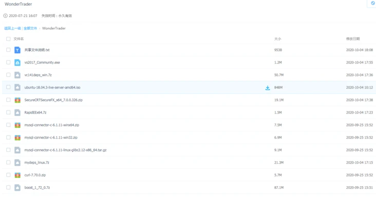

### Linux本地开发环境搭建
#### 1、系统准备
**WonderTrader**官方的`Linux`开发环境为`Ubuntu Server 18.04 LTS`，可以使用`WSL`、虚拟机或者`Docker`进行系统初始化的工作。

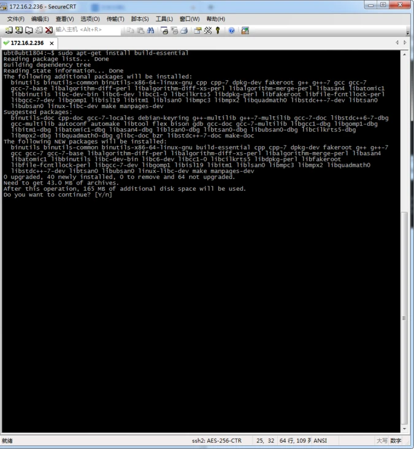

`WSL`可以直接在应用商店，安装`Ubuntu 18.04.6 LTS`，如下图：

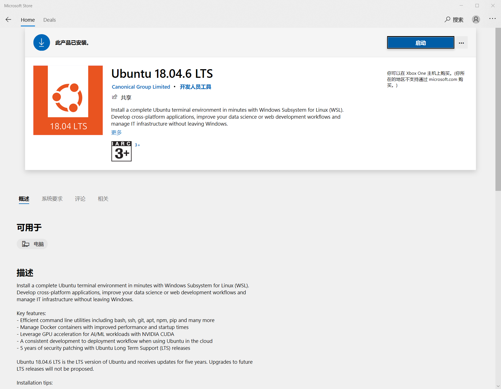

如果使用`Docker`，可以直接使用以下命令拉取`ubuntu:18.04`的镜像：
```shell
$ docker pull ubuntu:18.04
```
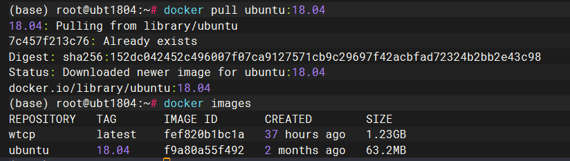

然后进入到docker容器中，命令如下：
```shell
$ docker run -it ubuntu:18.04 /bin/bash
```

#### 2、安装开发工具

直接执行以下命令，安装`gcc8`，`ubuntu 18.04`，对应的`gcc8`的版本为`gcc8.4.0`
```shell
# 安装编译工具
$ apt-get install -y git 
$ apt-get install -y gcc-8 
$ apt-get install -y g++-8 
$ apt-get install -y cmake
```

由于`Ubuntu 18.04`默认安装的`gcc`版本是`7.5.0`，安装`cmake`的时候会自动安装`gcc7.5.0`，所以我们还需要对`gcc`命令符号做一个处理
```shell
# 将gcc符号链接到gcc8
$ rm /usr/bin/gcc
$ ln -s /usr/bin/gcc-8 /usr/bin/gcc
$ ln -s /usr/bin/g++-8 /usr/bin/g++
```

使用`gcc --v`查看`gcc`的版本号

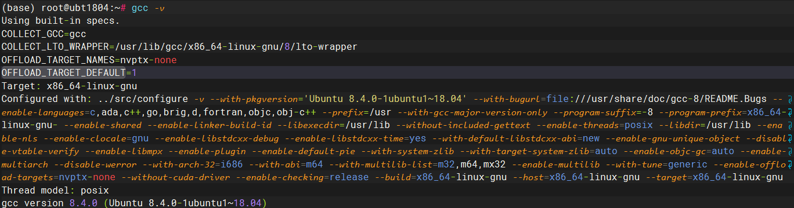


使用`cmake --version`查看`cmake`的版本号

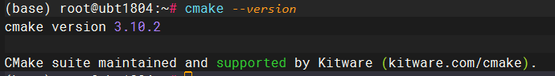

安装`7z`解压工具，用于解压预编译的依赖包
```shell
$ sudo apt-get install p7zip-full
```
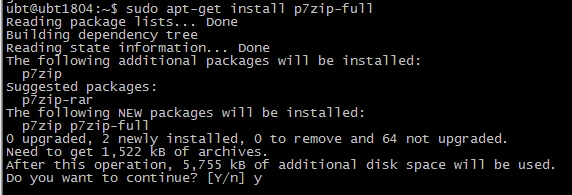

#### 3、从`共享资源`中下载`mydes_gcc8.4.0.7z`并上传到linux

* 如果是通过terminal工具连接的话，推荐使用WindTerm上传

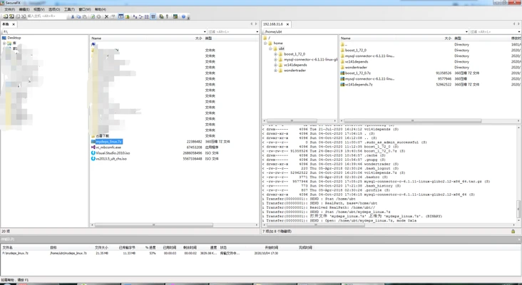

* 如果是WSL的话，可以直接访问Windows的文件系统

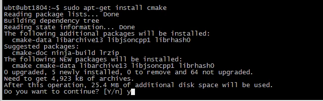


* 或者直接使用scp命令行上传
```shell
$ scp -r mydes_gcc8.4.0.7z root@192.168.61.128:/home
```

#### 4、将`mydes_gcc8.4.0.7z`解压到`/home`下
```shell
$ sudo 7za x mydes_gcc8.4.0.7z /home
```

#### 5、拉取`WonderTrader`的源码
```shell
$ cd /home
$ sudo git clone https://github.com/wondertrader/wondertrader.git
```

#### 6、进入`src`目录，执行编译脚本
```shell
$ bash build_release.sh
```
编译成功截图如下：

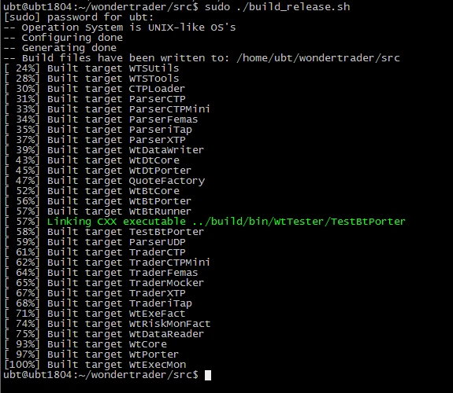

编译完成以后，就可以直接从`src`目录下的`build/bin`中下载需要的文件即可。

#### 7、复制二进制文件到wtpy
如果要将`linux`下编译的二进制文件，复制到`wtpy`中，还可以使用文件复制脚本`copy_bins_linux.sh`，命令行如下：
```shell
$ bash copy_bins_linux.sh /home/wpy
```

### Windows开发环境搭建
#### 1、安装`vs2017`社区版
首先下载`vs2017`的安装器，下载地址如下：
[https://visualstudio.microsoft.com/zh-hans/vs/older-downloads/](https://visualstudio.microsoft.com/zh-hans/vs/older-downloads/)

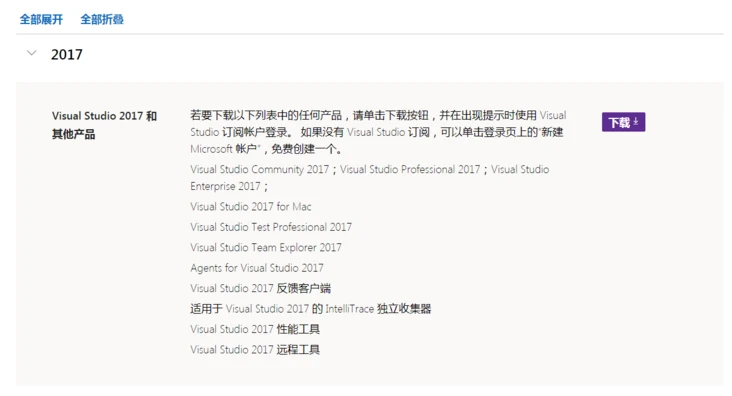

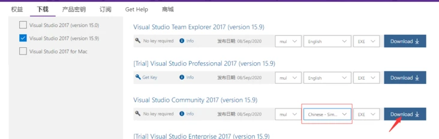

或者直接从**共享资源**中直接下载该安装器

#### 2、从`共享资源`中下载`vc141deps_win.7z`，并解压到`E:/vc141depends`目录
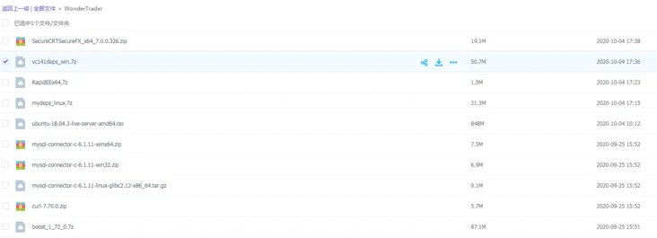

#### 3、配置环境变量

从**共享资源**中下载环境变量编辑器`RapidEE`到本地，解压以后运行。
新建一个名为`MyDepends141`的环境变量，并将值设置为依赖库解压目录`E:/vc141depends`

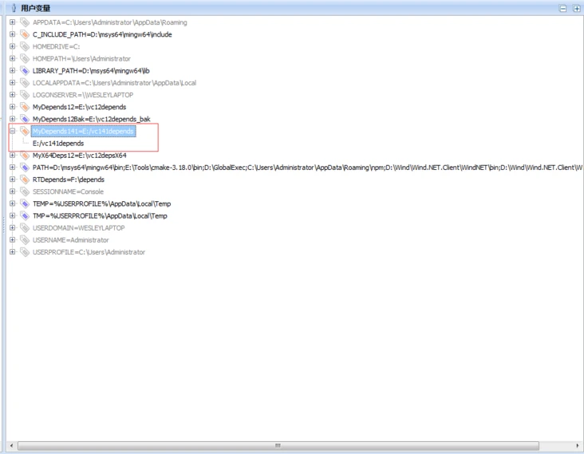

设置好了以后，保存环境变量，即可生效，如果没有生效，可以重启电脑。`win10`下要注意一下使用**管理员身份运行**`RapidEE`，不然保存可能会失败！

#### 4、安装`git`

下载git并安装：[https://git-scm.com/download/win](https://git-scm.com/download/win)

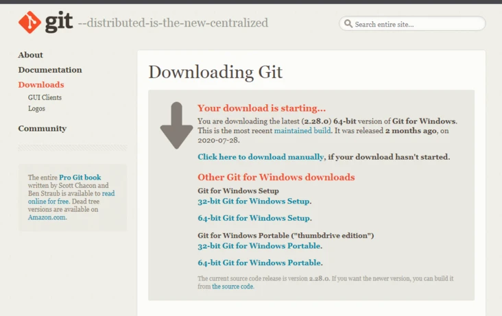

下载tortoisegit并安装：[https://tortoisegit.org/download/](https://tortoisegit.org/download/)

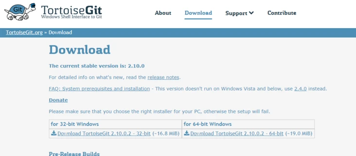

#### 5、下载代码
选择一个目录，然后右键点击该目录，选择“**Git克隆**”菜单

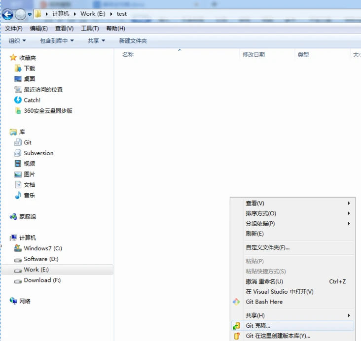

URL设置为:<https://github.com/wondertrader/wondertrader.git>

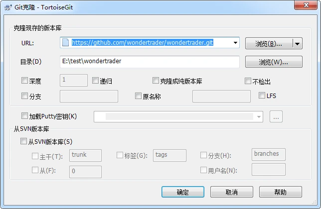

#### 6、编译代码
进入到`wondertrader`的`src`目录下

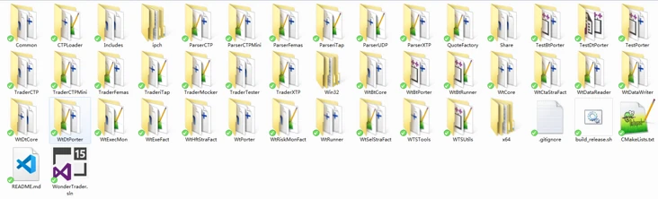

双击运行`wondertrader.sln`，打开以后在解决方案上右键点击，选择“**生成解决方案**”就进入了编译过程


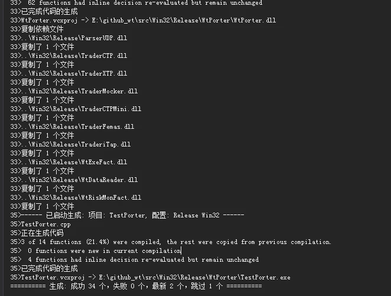


#### 7、复制到wtpy
进入到`wondertrader`目录，双击运行`copy_bins_win.bat`批处理文件，就可以自动将编译好的二进制文件复制到wtpy对应的目录下了，运行截图如下：

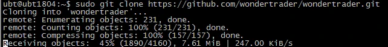


### Docker开发环境搭建
**WonderTrader**的`0.9.8`版本，将`C++`标准升级到了`C++17`。主要因为`0.9.8`版本，引入了一个新的`hash`容器`ankerl::unordered_dense`，该容器相比以前的`robin_map`，性能可以提升**1/3**左右，但是该容器必须要求`C++17`以上的标准。
鉴于此，**WonderTrader**的标准也升级到了`C++17`。但是原来的编译环境`Centos7` + `gcc 4.8.5`，只支持`C++11`，`gcc8`以上才支持`C++17`。经过测试，`Centos7`下的的`gcc8`的版本为`gcc8.3.1`，该版本下编译还是不成功，而`Ubuntu 18.04`下的`gcc8`为`gcc8.4.0`，该版本下就能够编译成功。
由于`gcc`版本的要求，开发环境搭建会变得更加复杂，为了方便大家使用，就提供了内置的`Dockerfile`。
在`wondertrader/docker`下，有两个`Dockerfile`：
- Dockerfile：
    * 这个`dockerfile`直接拉取`dockerhub`上提交的`wondertrader`镜像，镜像大小约500M
    * `wondertrader`镜像，基于`ubuntu18.04`进行构建，安装了`gcc8.4.0`等编译工具
    * 并且自动从`gitee上`拉取源码
    * 基于该文件构建镜像可以使用命令：` docker build -t yourimagename -f Dockerfile .`
    * 构建完成以后，要启动容器，可以使用命令： `docker run -it yourimagename /bin/bash`
- Dockerfile_ubt:
    * 这个`dockerfile`直接基于`ubuntu18.04`镜像构建，镜像大小约66M，拉取速度较快
    * 拉取完以后，再安装`gcc8.4.0`等编译工具
    * 并且自动从`gitee上`拉取源码
    * 基于该文件构建镜像可以使用命令：`docker build -t yourimagename -f Dockerfile_ubt .`
    * 构建完成以后，要启动容器，可以使用命令：`docker run -it yourimagename /bin/bash`

#### 1、构建自己的本地镜像
用户可以根据自己的需要，通过这两个`Dockerfile`直接构建自己的开发镜像，命令行如下：
```shell
$ docker build -t wtcpp -f Dockerfile .
```

运行截图如下：

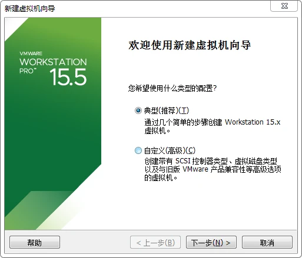

#### 2、运行容器
本地镜像构建好了，就可以使用以下命令运行容器了
```shell
$ docker run -it mycpp /bin/bash
```

运行截图如下：
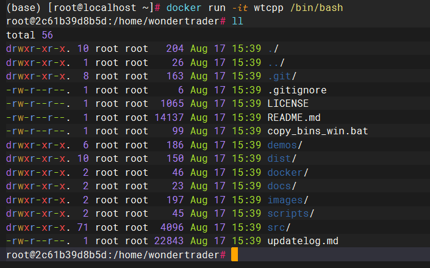

#### 3、编译构建
将目录转到/home/wondertrader/src，执行编译脚本即可
```shell
$ cd /home/wondertrader/src
$ bash build_release.sh
```

