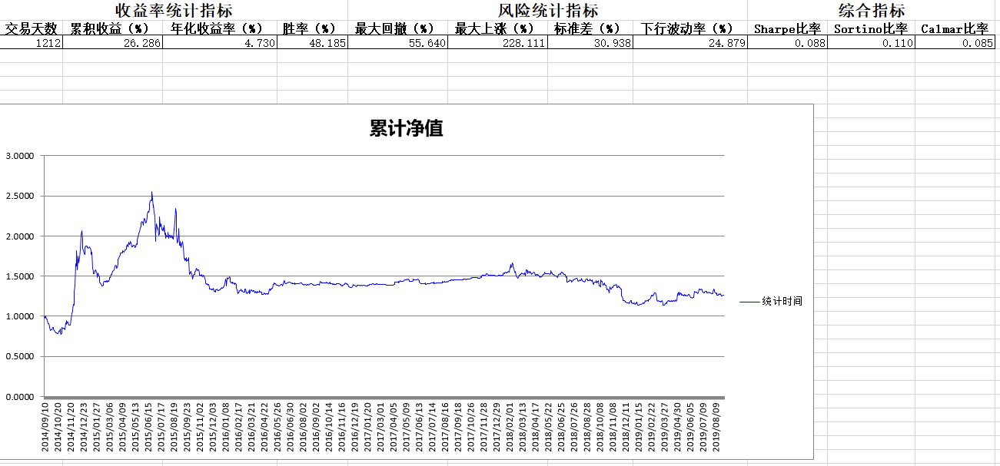
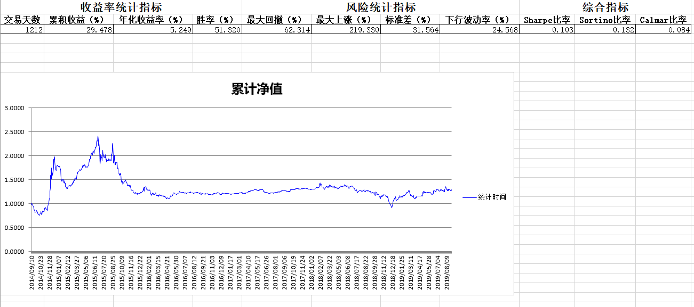
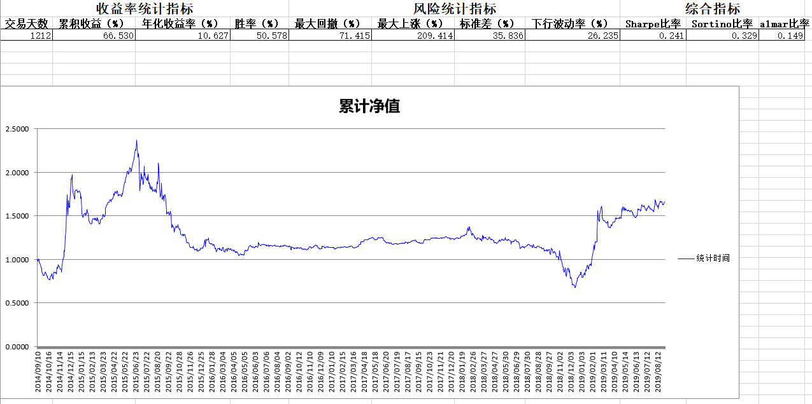
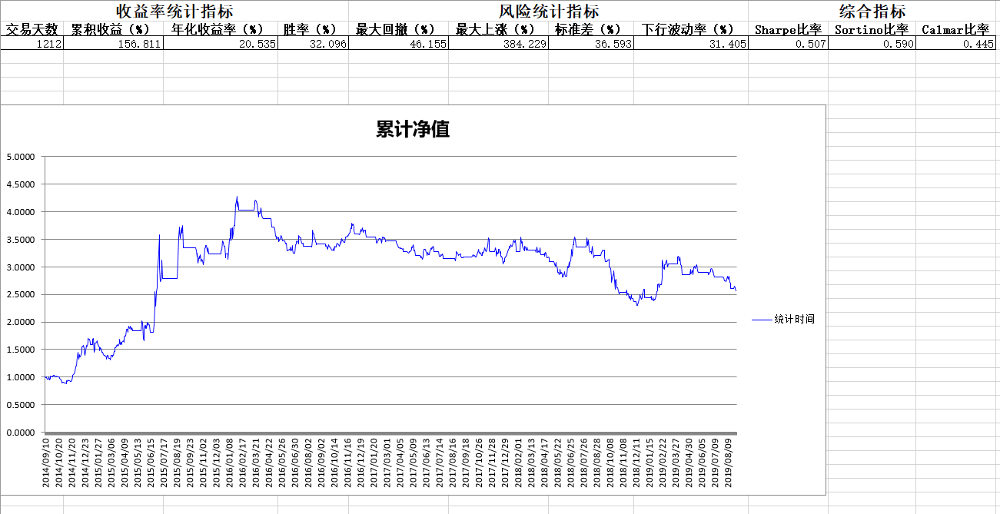

# 经典跨日CTA策略

#### 1.要实现的cta策略简介

本文主要介绍几种趋势型cta跨日策略在wtpy上的实现过程，选择了四个策略：均线、布林线、ATR通道、MACD。

##### 1.1均线策略

均线策略是一种既可以简单又可以复杂的策略，想要简单可以只用一条短均线突破长 均线作为买卖点，想要复杂可以叠加多周期均线或者多空头排列，我们在此仅以收盘价突 破 N 日均线作为策略基础，具体策略设定如下：

1.上轨 = N 日均线 ×（1＋b%）

2.下轨 = N 日均线 ×（1－b%）

3.收盘价突破上轨下一交易日做多

4.收盘价突破下轨下一交易日做空

5.收盘价回复到均线位置平仓

6.单笔交易亏损 1%下一交易日平仓

我们的均线策略就 2 个参数：均线周期 N、开仓线宽度 b。其中当 b=0 时，就是最原 始的均线突破，我们这里加了一个宽度参数 b 使得其成为一个通道策略，在寻找参数的过 程中可以同时尝试两种策略。

##### 1.2布林线

布林线策略我们也采用 2 个参数，具体设定如下：

1.上轨 = N 日均线 ＋ b × Std（N）

2.下轨 = N 日均线 － b × Std（N）

3.收盘价突破上轨下一交易日做多

4.收盘价突破下轨下一交易日做空

5.收盘价回复到均线位置平仓

6.单笔交易亏损 1%下一交易日平仓

其中 N 为采用均线的周期，b 为布林带宽度。

##### 1.3ATR通道

ATR 通道策略与布林线策略也比较类似，但是其带宽计算采用 ATR 值。ATR 全称 Average True Range，一般称作平均真实波幅，由 J. Welles Wilder Jr 发明，可以用来衡量 价格的波动性。ATR 指标并不会指出市场波动的方向，仅仅以价格波动的幅度来表明市场 的波动性。Wilder 定义真实波动范围（TR）为以下的最大者：

当前交易日的最高价减去当前交易日的最低价。

当前交易日的最高价减去前一交易日收盘价的绝对值

当前交易日的最低价减去前一交易日收盘价的绝对值。

根据以上方法计算出的 TR（真实波幅）的 N 日平均值就是 ATR，ATR 指标是一个非常好的入场工具，它并不会告诉我们市场将会向哪个方向波动，但是可以告诉我们当前市场的 波动水平。根据 ATR得出的波动幅度我们可以鉴别出市场的横盘整理区间，当价格突破这个横盘整理区间的时候，市场很有可能形成了某种趋势，我们可以入场进行交易。根据 ATR 计算出来的横盘整理区间，我们获得了一个通道突破策略：

1.通道上轨 = N 日均价＋ N 日 ATR * b；

2.通道下轨 = N 日均价－ N 日 ATR * b；

3.收盘价突破上轨下一交易日做多

4.收盘价突破下轨下一交易日做空

5.收盘价回复到均线位置平仓

6.单笔交易亏损 1%下一交易日平仓

其中均线以及 ATR 采用相同周期 N，b 为带宽参数。以上三个策略我们都只用到了 2 个类似的参数：周期、带宽。

##### 1.4MACD策略

MACD 也是最常见的技术指标之一，但是它所涉及计算相比于前三种策略略微复杂。通常 MACD 利用收盘价的短期（常用为 12 日）指数移动平均线与长期（常用为 26 日）指数移动平均线之间的聚合与分离状况，对买进、卖出时机作出研判的技术指标。其计算方法如下：

K1 日 EMA（K1） = 前一日 EMA（K1）×（K1－1）/（K1＋1） + 收盘价×2/(K1 ＋1)

K2 日 EMA（K2） = 前一日 EMA（K2）×（K2－1）/（K2＋1） + 收盘价×2/(K2 ＋1)

差离值 DIF = EMA（K1）－EMA（K2）

根据差离值 DIF 计算其 N 日的 EMA，即离差平均值，是所求的 DEA 值

今日 DEA = 前一日 DEA×（N－1）/（N＋1） + 今日 DIF×2/（N＋1）

MACD = 2 ×（DIF － DEA）；

DIF > 0 & MACD > 0 ，入场做多

DIF < 0 & MACD < 0 ，入场做空

DIF < 0 平多，DIF > 0 平空

单笔交易亏损 1%下一交易日平仓

在 MACD 策略中，我们有 3 个参数：K1 为快均线周期参数，K2 为慢均线周期参数， N 为 DEM 周期参数。

#### 2.策略实现

##### 2.1 均线策略、布林带策略和ATR策略

根据以上对于策略逻辑的简单介绍，不难发现前三个策略的交易逻辑几乎相同，使用的参数都为两个，且参数功能都是用于决定周期与通道宽度。策略之间的区别仅在于计算通道上下轨的过程不同，计算出了上下轨后，三个策略的交易逻辑都完全相同了。因此笔者将前三个策略写在一个py文件里，传入一个参数进行控制文件使用哪种策略的计算方法。

```python
# 在def __init__()中加入策略使用的参数
        self.__k__ = k  # n日均线加上k倍指标作为上轨和下轨 (AVG时，k是百分数如0.01)
        self.__days__ = days  # 取的均线天数
        self.__type__ = type  # 策略种类，有三种，AVG均线策略，BOLL布林带，ATR平均真实波幅
# 在def on_calculate()中根据type的种类分别计算通道上下轨
        if type not in ['AVG', 'BOLL', 'ATR']:
            print('输入的type错误,应输入AVG,BOLL,ATR中的一个')
            exit()
        if type == 'AVG':
            up_price = ma_days * (1+k)
            down_price = ma_days * (1-k)
        elif type == 'BOLL':
            std = np.std(closes[-days:-1])
            up_price = ma_days + k * std
            down_price = ma_days - k * std
        elif type == 'ATR':
            highs = df_bars.highs
            lows = df_bars.lows
            closes = df_bars.closes
            TR_SUM = 0
            for i in range(days):
                TR_SUM += max(highs[-1 - i] - lows[-1 - i], highs[-1 - i] - closes[-2 - i],
                              closes[-2 - i] - lows[-1 - i])
            ATR = TR_SUM / days
            up_price = ma_days + k * ATR
            down_price = ma_days - k * ATR
```

策略的交易逻辑需要在当日进行判断后，下一交易日才执行相应的交易行为，例如：收盘价突破上轨下一交易日做多、收盘价突破下轨下一交易日做空、单笔交易亏损 1%下一交易日平仓。在回测中，实现下一交易日开盘即进行交易需要在当前交易日的最后一根bar发出交易指令，即用5分钟线数据时，对于没有夜盘的品种，需要在14：55~15：00发出交易指令，这样程序就会在下一根bar的开盘执行交易。当策略在日内确认当前价格满足策略的开仓平仓条件时，记录一个self.trade_next_day，self.trade_next_day =-1，1，0分别代表了下一交易日做空、做多以及平仓。

策略控制下一交易日执行交易的具体代码：

```python
    def on_session_begin(self, context:CtaContext, curTDate:int): # 写在def on_calculate()之前，每个交易日开始的时候会运行一次，重置self.trade_next_day的值
        self.trade_next_day = 2
```

```python
        # 当前未持仓且价格突破上轨，记录self.trade_next_day为1（做多）；当前未持仓且价格跌破下轨，记录self.trade_next_day为-1（做空），单笔交易亏损1%，记录self.trade_next_day为0（平仓）
    	if curPrice > up_price and curPos == 0:
            self.trade_next_day = 1
        elif curPrice < down_price and curPos == 0:
            self.trade_next_day = -1
        if cur_money < self.cur_money * 0.99 and curPos != 0:
            self.trade_next_day = 0
```

```python
        # 判断当前的交易时间是否在当日最后一根bar期间，然后用self.trade_next_day记录的下一交易日操作进行交易。每次开仓后记录开仓时的总资金self.cur_money，以便用于判断亏损是否超过1%
    	if curTime >= 1455 and curTime <= 1500:
            if self.trade_next_day == 1:
                context.stra_enter_long(code,math.floor(self.cur_money*money_pct/trdUnit_price)
                                        ,'enterlong')
                self.cur_money = capital + context.stra_get_fund_data(0)
                context.stra_log_text('下一交易日做多%s手'% (math.floor(self.cur_money*money_pct/trdUnit_price)))
            elif self.trade_next_day == -1:
                context.stra_enter_short(code,math.floor(self.cur_money*money_pct/trdUnit_price)
                                        ,'entershort')
                self.cur_money = capital + context.stra_get_fund_data(0)
                context.stra_log_text('下一交易日做空%s手'% (math.floor(self.cur_money*money_pct/trdUnit_price)))
            elif self.trade_next_day == 0:
                context.stra_set_position(code, 0, 'clear')
                context.stra_log_text('亏损超过百分之一，下一交易日平仓')
```

这样这三个策略实现中会遇到的问题就基本解决了，文档最后也会给出完整的策略代码。

##### 2.2MACD策略

MACD策略的难点在于各项指标的计算方法要相对较为复杂，但在python中可以用5行代码比较简单地实现各个指标的计算，代码如下：

```python
        # k1,k2,days是MACD策略的三个参数
    	df = pd.DataFrame(columns=['closes'],data=closes)
        df['EMA_short'] = df['closes'].ewm(span=k1,adjust=False).mean()
        df['EMA_long'] = df['closes'].ewm(span=k2,adjust=False).mean()
        df['DIF'] = df['EMA_short'] - df['EMA_long']
        df['DEA'] = df['DIF'].ewm(span=days, adjust=False).mean()
        df['MACD'] = (df['DIF']-df['DEA']) * 2
```

有了MACD的各项数据指标，根据这个指标进行的交易逻辑的代码也呼之欲出了：

```python
        if df['MACD'].iloc[-1] > 0 and df['DIF'].iloc[-1] > 0 and curPos == 0:
            context.stra_enter_long(code, math.floor(self.cur_money * money_pct / trdUnit_price)
                                    , 'enterlong')
            self.cur_money = capital + context.stra_get_fund_data(0)
            context.stra_log_text('入场做多%s手' % (math.floor(self.cur_money * money_pct / trdUnit_price)))
        elif df['MACD'].iloc[-1] < 0 and df['DIF'].iloc[-1] < 0 and curPos == 0:
            context.stra_enter_short(code, math.floor(self.cur_money * money_pct / trdUnit_price)
                                     , 'entershort')
            self.cur_money = capital + context.stra_get_fund_data(0)
            context.stra_log_text('入场做空%s手' % (math.floor(self.cur_money * money_pct / trdUnit_price)))
        elif df['DIF'].iloc[-1] < 0 and curPos > 0:
            context.stra_set_position(code, 0, 'clear')
            context.stra_log_text('DIF < 0，平多')
        elif df['DIF'].iloc[-1] > 0 and curPos < 0:
            context.stra_set_position(code, 0, 'clear')
            context.stra_log_text('DIF > 0，平空')
        curTime = context.stra_get_time()
        cur_money = capital + context.stra_get_fund_data(code)
        if cur_money < self.cur_money * 0.99 and curPos != 0:
            self.trade_next_day = 0
        if curTime >= 1455 and curTime <= 1500:
            if self.trade_next_day == 0:
                context.stra_set_position(code, 0, 'clear')
                context.stra_log_text('亏损超过百分之一，下一交易日平仓')
```

以上代码实现了DIF > 0 & MACD > 0 ，入场做多、DIF < 0 & MACD < 0 ，入场做空、DIF < 0 平多，DIF > 0 平空、单笔交易亏损 1%下一交易日平仓的交易逻辑。

#### 3.策略回测

选用20140910~20190901的股指期货主力合约5分钟和日线进行回测

均线策略使用参数days=10，k=0.01的回测结果:



布林带策略使用参数days=10,k=0.5的回测结果：



ATR策略使用参数days=10，k=0.1的回测结果:



MACD策略使用经典的k1=12,k2=26,days=9的一组参数的回测结果：



以上策略的回测表现都比较一般，如果从2016年开始计算，除了ATR策略依靠最后阶段的表现有部分收益，其他三个策略都处于亏损状态。不过作为趋势型策略，在2015的牛市中都还是有比较不错的收益。

#### 4.完整代码

4.1 均线、ATR、布林带策略代码

```python
from wtpy import BaseCtaStrategy
from wtpy import CtaContext
import numpy as np
import math

class CombinationStra(BaseCtaStrategy):
    
    def __init__(self, name:str, code:str, barCnt:int,
                 period:str, margin_rate:float, money_pct:float, capital, k:float, days:int,type:str):
        BaseCtaStrategy.__init__(self, name)

        self.__period__ = period
        self.__bar_cnt__ = barCnt
        self.__code__ = code
        self.__margin_rate__ = margin_rate # 保证金比率
        self.__money_pct__ = money_pct # 每次使用的资金比率
        self.__capital__ = capital
        self.__k__ = k  # n日均线加上k倍指标作为上轨和下轨 (AVG时，k是百分数如0.01)
        self.__days__ = days  # 取的均线天数
        self.__type__ = type  # 策略种类，有三种，AVG均线策略，BOLL布林带，ATR平均真实波幅

    def on_init(self, context:CtaContext):
        code = self.__code__    # 品种代码
        type = self.__type__
        context.stra_get_bars(code, 'd1', self.__bar_cnt__, isMain=False)
        context.stra_get_bars(code, self.__period__, self.__bar_cnt__, isMain = True)
        context.stra_log_text("%sStra inited" % (type))
        pInfo = context.stra_get_comminfo(code)
        self.__volscale__ = pInfo.volscale


    def on_session_begin(self, context:CtaContext, curTDate:int):
        self.trade_next_day = 2

    def on_calculate(self, context:CtaContext):
        code = self.__code__    #品种代码
        # 把策略参数读进来，作为临时变量，方便引用
        curPrice = context.stra_get_price(code)
        margin_rate = self.__margin_rate__
        money_pct = self.__money_pct__
        volscale = self.__volscale__
        capital = self.__capital__
        days = self.__days__
        k = self.__k__
        type = self.__type__
        trdUnit_price = volscale * margin_rate * curPrice
        curPos = context.stra_get_position(code)
        if curPos == 0:
            self.cur_money = capital + context.stra_get_fund_data(0)

        df_bars = context.stra_get_bars(code, 'd1', self.__bar_cnt__, isMain=False)
        closes = df_bars.closes
        ma_days = np.average(closes[-days:-1])
        if type not in ['AVG', 'BOLL', 'ATR']:
            print('输入的type错误,应输入AVG,BOLL,ATR中的一个')
            exit()
        if type == 'AVG':
            up_price = ma_days * (1+k)
            down_price = ma_days * (1-k)
        elif type == 'BOLL':
            std = np.std(closes[-days:-1])
            up_price = ma_days + k * std
            down_price = ma_days - k * std
        elif type == 'ATR':
            highs = df_bars.highs
            lows = df_bars.lows
            closes = df_bars.closes
            TR_SUM = 0
            for i in range(days):
                TR_SUM += max(highs[-1 - i] - lows[-1 - i], highs[-1 - i] - closes[-2 - i],
                              closes[-2 - i] - lows[-1 - i])
            ATR = TR_SUM / days
            up_price = ma_days + k * ATR
            down_price = ma_days - k * ATR
        # 获取昨日收盘价
        if curPrice > up_price and curPos == 0:
            self.trade_next_day = 1
        elif curPrice < down_price and curPos == 0:
            self.trade_next_day = -1
        elif curPrice < ma_days and curPos > 0:
            context.stra_set_position(code, 0, 'clear')
            context.stra_log_text('收盘价回复到均线位置，平仓')
        elif curPrice > ma_days and curPos < 0:
            context.stra_set_position(code, 0, 'clear')
            context.stra_log_text('收盘价回复到均线位置，平仓')
        curTime = context.stra_get_time()
        cur_money = capital + context.stra_get_fund_data(code)
        if cur_money < self.cur_money * 0.99 and curPos != 0:
            self.trade_next_day = 0
        if curTime >= 1455 and curTime <= 1500:
            if self.trade_next_day == 1:
                context.stra_enter_long(code,math.floor(self.cur_money*money_pct/trdUnit_price)
                                        ,'enterlong')
                self.cur_money = capital + context.stra_get_fund_data(0)
                context.stra_log_text('下一交易日做多%s手'% (math.floor(self.cur_money*money_pct/trdUnit_price)))
            elif self.trade_next_day == -1:
                context.stra_enter_short(code,math.floor(self.cur_money*money_pct/trdUnit_price)
                                        ,'entershort')
                self.cur_money = capital + context.stra_get_fund_data(0)
                context.stra_log_text('下一交易日做空%s手'% (math.floor(self.cur_money*money_pct/trdUnit_price)))
            elif self.trade_next_day == 0:
                context.stra_set_position(code, 0, 'clear')
                context.stra_log_text('亏损超过百分之一，下一交易日平仓')
```

4.2MACD策略代码

```python
import pandas as pd

from wtpy import BaseCtaStrategy
from wtpy import CtaContext
import numpy as np
import math

class MACDStra(BaseCtaStrategy):
    
    def __init__(self, name:str, code:str, barCnt:int,
                 period:str, margin_rate:float, money_pct:float, capital, k1:float,k2:float,days:int):
        BaseCtaStrategy.__init__(self, name)

        self.__period__ = period
        self.__bar_cnt__ = barCnt
        self.__code__ = code
        self.__margin_rate__ = margin_rate # 保证金比率
        self.__money_pct__ = money_pct # 每次使用的资金比率
        self.__capital__ = capital
        self.today_entry = 0  # 限制每天开仓次数的参数
        self.__k1__ = k1  # 短EMA的天数
        self.__k2__ = k2  # 长EMA的天数
        self.__days__ = days  #

    def on_init(self, context:CtaContext):
        code = self.__code__    # 品种代码

        context.stra_get_bars(code, 'd1', self.__bar_cnt__, isMain=False)
        context.stra_get_bars(code, self.__period__, self.__bar_cnt__, isMain = True)
        context.stra_log_text("MACDStra inited")
        pInfo = context.stra_get_comminfo(code)
        self.__volscale__ = pInfo.volscale


    def on_session_begin(self, context:CtaContext, curTDate:int):
        self.trade_next_day = 2

    def on_calculate(self, context:CtaContext):
        code = self.__code__    #品种代码
        # 把策略参数读进来，作为临时变量，方便引用
        curPrice = context.stra_get_price(code)
        margin_rate = self.__margin_rate__
        money_pct = self.__money_pct__
        volscale = self.__volscale__
        capital = self.__capital__
        days = self.__days__
        k1 = self.__k1__
        k2 = self.__k2__
        trdUnit_price = volscale * margin_rate * curPrice
        curPos = context.stra_get_position(code)
        if curPos == 0:
            self.cur_money = capital + context.stra_get_fund_data(0)
        df_bars = context.stra_get_bars(code, 'd1', self.__bar_cnt__, isMain=False)
        closes = df_bars.closes
        # 计算MACD
        df = pd.DataFrame(columns=['closes'],data=closes)
        df['EMA_short'] = df['closes'].ewm(span=k1,adjust=False).mean()
        df['EMA_long'] = df['closes'].ewm(span=k2,adjust=False).mean()
        df['DIF'] = df['EMA_short'] - df['EMA_long']
        df['DEA'] = df['DIF'].ewm(span=days, adjust=False).mean()
        df['MACD'] = (df['DIF']-df['DEA']) * 2
        # 获取昨日收盘价
        if df['MACD'].iloc[-1] > 0 and df['DIF'].iloc[-1] > 0 and curPos == 0:
            context.stra_enter_long(code, math.floor(self.cur_money * money_pct / trdUnit_price)
                                    , 'enterlong')
            self.cur_money = capital + context.stra_get_fund_data(0)
            context.stra_log_text('入场做多%s手' % (math.floor(self.cur_money * money_pct / trdUnit_price)))
        elif df['MACD'].iloc[-1] < 0 and df['DIF'].iloc[-1] < 0 and curPos == 0:
            context.stra_enter_short(code, math.floor(self.cur_money * money_pct / trdUnit_price)
                                     , 'entershort')
            self.cur_money = capital + context.stra_get_fund_data(0)
            context.stra_log_text('入场做空%s手' % (math.floor(self.cur_money * money_pct / trdUnit_price)))
        elif df['DIF'].iloc[-1] < 0 and curPos > 0:
            context.stra_set_position(code, 0, 'clear')
            context.stra_log_text('DIF < 0，平多')
        elif df['DIF'].iloc[-1] > 0 and curPos < 0:
            context.stra_set_position(code, 0, 'clear')
            context.stra_log_text('DIF > 0，平空')
        curTime = context.stra_get_time()
        cur_money = capital + context.stra_get_fund_data(code)
        if cur_money < self.cur_money * 0.99 and curPos != 0:
            self.trade_next_day = 0
        if curTime >= 1455 and curTime <= 1500:
            if self.trade_next_day == 0:
                context.stra_set_position(code, 0, 'clear')
                context.stra_log_text('亏损超过百分之一，下一交易日平仓')
```

将策略代码的.py文件放入wtpy/demos/cta_fut_bt/strategies，然后修改runBT文件，传入相应的参数，即可自己进行策略的回测。

至此，在wtpy上实现一些cta策略的示例文档结束了，读者可以选其中感兴趣的策略自己回测一下，也可以参考其中的一些写法做自己想做的策略。