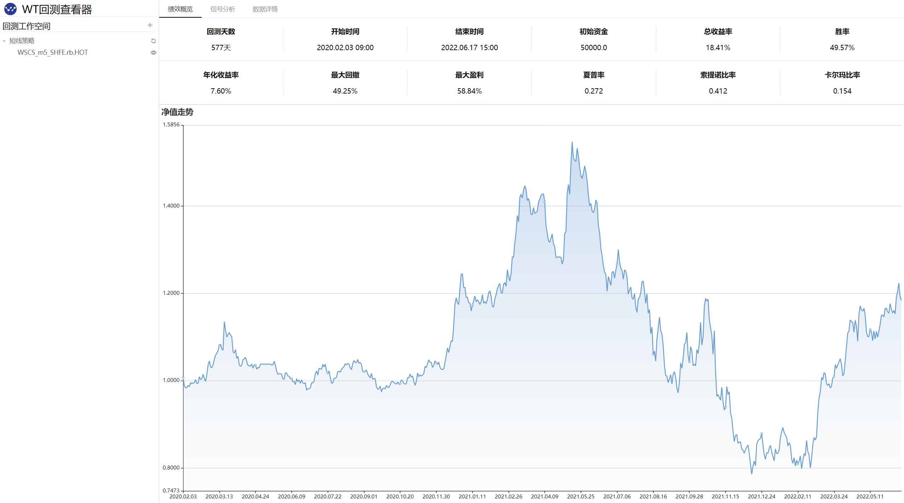
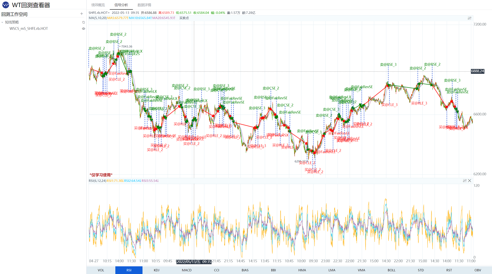
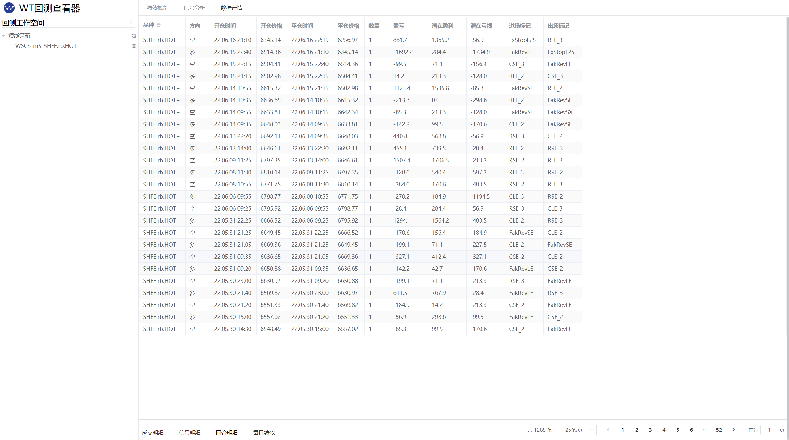

# WtBtSnooper

### `WtBtSnooper`是什么
---
我们在做策略回测的时候，除了看绩效指标风控指标以外，还有一个很重要的一点，就是查看一下交易信号。**WonderTrader**回测的时候会自动生成交易信号，可以通过`trades.csv`和`closes.csv`进行查看。

虽然通过调用`WtBtAnalyst`可以生成回测的`excel`绩效报告，但是我们还是希望能够通过图形化的方式来查看回测的绩效报告，这样更加直观。`WtBtSnooper`就是为了解决这个问题的，不光是提供了图形化的界面，更为重要的是，`WtBtSnooper`结合`WtDtServo`，提供了回测交易信号的展示。

### WtBtSnooper的实现
---
整个`WtBtSnooper`采用的是`b/s`结构，`wtpy.monitor.WtBtSnooper`利用`fastapi`实现一个`http`的`server`，这个`server`包含`html`的文件服务，通过`url`就可以访问一个`web`页面，在页面上进行配置就可以查看。








### WtBtSnooper怎么用
---
要使用`WtBtSnooper`，只需要启动一下服务即可，代码如下：
```py
from wtpy.monitor import WtBtSnooper
from wtpy import WtDtServo

def testBtSnooper():    

    dtServo = WtDtServo()
    # 这里配置的是基础数据文件目录
    dtServo.setBasefiles(folder="E:\\gitlocal\\MyStras\\CTA\\common\\")

    # 这里配置的是datakit落地的数据目录
    dtServo.setStorage(path='E:/storage/')

    snooper = WtBtSnooper(dtServo)
    snooper.run_as_server(port=8081)

testBtSnooper()
# 运行了服务以后，在浏览器打开以下网址即可使用
# http://127.0.0.1:8081/backtest/backtest.html

```
